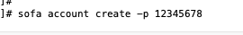
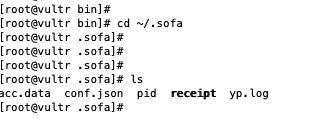
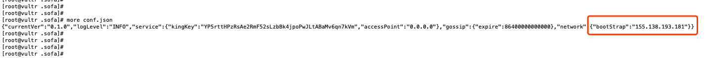
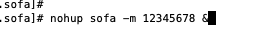
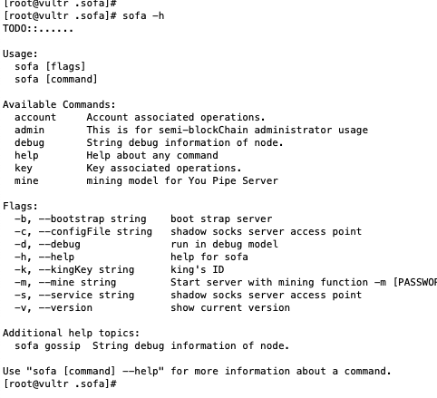

# SoFa-Network
## 项目介绍 
SoFa-Network（虫洞网络），是一个融合了网络通信协议、区块链账本和应用层 SDK 的互联网底层通信基础设施。SoFa-Network通过自主研发的 Multi-p2p-Protocol 构建了一个动态支持多协议的MPN 网络（ Multi-p2p-Network），并通过 Proof of Packet 包传输证明将网络节点之间的数据包传输交换进行签名和记账，通过区块链的方式对网络中节点之间的价值转移进行定量统计和结算。并在MPN 的基础上提供丰富的 SDK，以支持基于 SoFa-Network 的各类应用开发和落地使用。 

## 官方网站
官方网站：[https://sofa.one/](https://sofa.one/ "官方网站")

## 白皮书
* [中文版](./sofa-network项目白皮书.pdf)  
* [英文版](./sofa-network-white-paper.pdf)

## 部署教程
挖矿程序在[src](./src)目录下,文件名sofa
### Step1
将sofa文件上传到centos 7操作系统上  

把sofa所在的目录加到PATH环境变量中  

### Step2
为矿机创建区块链地址  

### Step3
配置启动设置，创建账号成功之后，在~/.sfoa目录下会生成配置文件  

conf.json是配置文件，receipt是挖矿的凭证数据库  

把该IP地址修改为自己系统的主启动节点，可以设置多个启动节点，目前阶段暂时不需要配置多个节点，最好先在启动节点上启动sofa，然后再配置其他节点。

### Step4
启动节点   

在后台启动sofa，其中-m参数就是区块链节点账号的解密口令，该口令也可以换一种安全的方式启动，防止在命令行暴露密码，目前阶段不需要。  
后台启动后，所有日志会在本目录先的nohpu.out中，可以将日志转到特定文件中用>转移符号即可，如果需要开始debug模式，可以在sofa命令后面添加 –d参数  
其他帮助可以使用help命令

