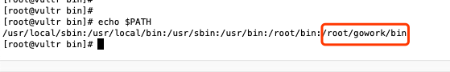

# SoFa-Network
## 项目介绍 
SoFa-Network（虫洞网络），是一个融合了网络通信协议、区块链账本和应用层 SDK 的互联网底层通信基础设施。SoFa-Network通过自主研发的 Multi-p2p-Protocol 构建了一个动态支持多协议的MPN 网络（ Multi-p2p-Network），并通过 Proof of Packet 包传输证明将网络节点之间的数据包传输交换进行签名和记账，通过区块链的方式对网络中节点之间的价值转移进行定量统计和结算。并在MPN 的基础上提供丰富的 SDK，以支持基于 SoFa-Network 的各类应用开发和落地使用。 

## 官方网站
官方网站：[https://sofa.one/](https://sofa.one/ "官方网站")

## 白皮书
* [中文版](./sofa-network项目白皮书.pdf)  
* [英文版](./sofa-network-white-paper.pdf)

## 部署教程
### Step1
* 将sofa文件上传到centos 7操作系统上： 

* 把sofa所在的目录加到PATH环境变量中：  

